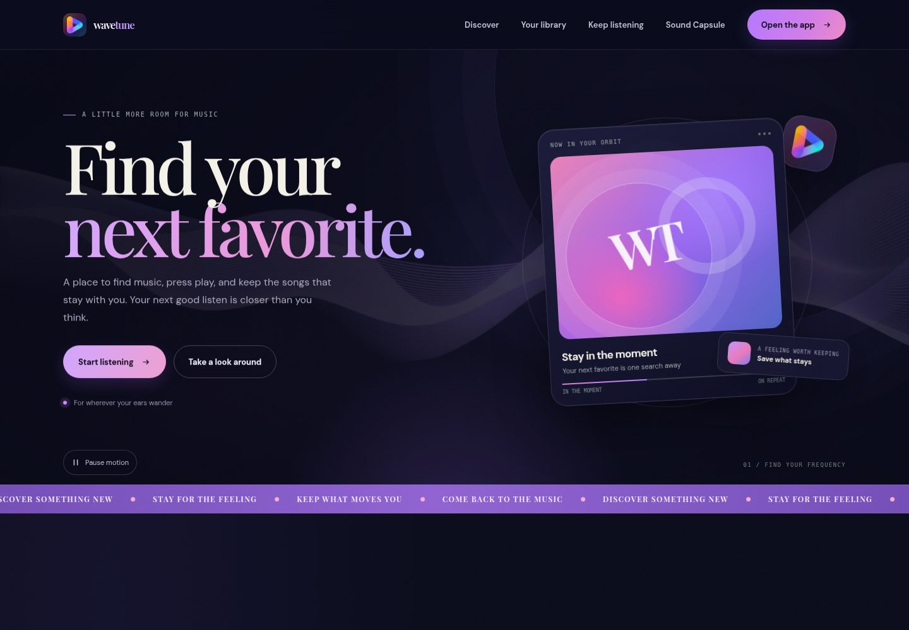
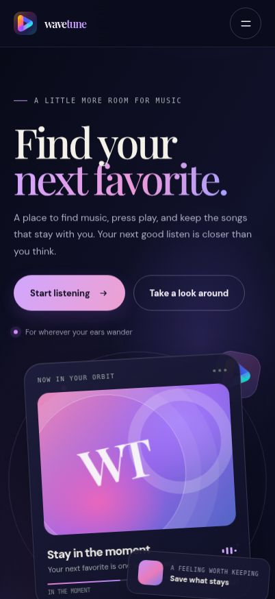
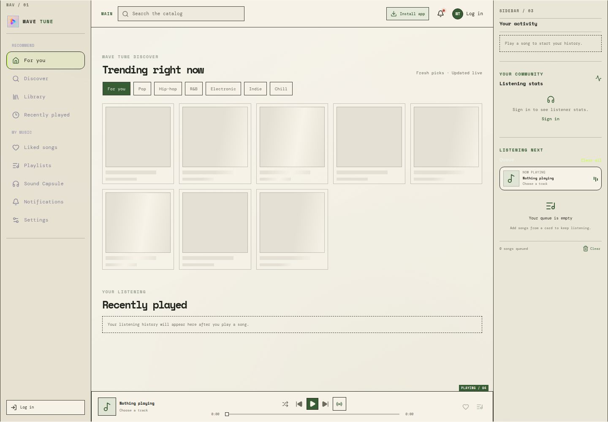
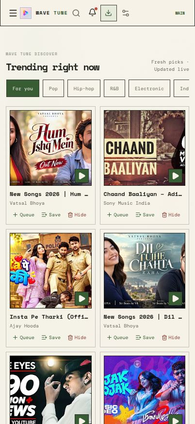

# Wave Tune

Wave Tune is a responsive music-discovery app and installable PWA. Search and play music, build a personal library, get recommendations, and revisit listening history with **Sound Capsule**.

[Open Wave Tune](https://wave-tune-music.pages.dev/) · [Local setup](SETUP.md) · [Deployment guide](DEPLOYMENT.md)

## Product previews

### Marketing landing page

The standalone landing page introduces Wave Tune and links visitors to the app.

| Desktop | Mobile |
| --- | --- |
|  |  |

### Music discovery app

| Desktop | Mobile |
| --- | --- |
|  |  |

## Features

- **Music discovery and playback:** search and browse a YouTube-powered music catalog.
- **“For you” recommendations:** suggestions use the track playing now, liked music, and listening history.
- **Personal library:** like tracks, save playlists, and return to recently played music.
- **Sound Capsule:** review a daily listening timeline, most-played tracks, and 7- or 30-day summaries. Listening history is private to the account.
- **Installable PWA:** includes app icons, a web manifest, a service worker, and an install guide.
- **Guest listening:** browse and play without an account. Google sign-in or email and password are available for saved account data.

## Technology

- React, TypeScript, and Vite for the web app
- Express and TypeScript for the API
- MongoDB for persistent account and library data
- Google Identity Services for Google sign-in
- YouTube-powered music search and playback

## Run locally

**Requirements:** Node.js 22.12 or newer and npm.

Run these commands from the repository root, alongside `package.json`:

```sh
npm ci
cp .env.example .env
npm run dev
```

Open `http://localhost:5000`. Express serves the API and Vite development app from one process. Guest browsing and playback work without account configuration; see [SETUP.md](SETUP.md) for MongoDB, Google sign-in, and environment setup.

To check a production build locally:

```sh
npm run build
npm run preview
```

## Hosting

The app and API use two services:

```text
Browser
  └─ Cloudflare Pages: React app + Pages Functions
       └─ /api/* forwards to Render
            └─ Render: Express API, account routes, and app fallback
```

The React app and `functions/` directory are at the repository root. Configure both Cloudflare Pages and Render with root directory `.`. The standalone marketing site is separate: deploy [`landing-page/`](landing-page/README.md) as a static site with no build command and `.` as its output directory. Its hero streams a Pexels-licensed waveform video on desktop and falls back to the CSS artwork on mobile or when reduced motion is preferred. See [DEPLOYMENT.md](DEPLOYMENT.md) for app settings and [landing-page/README.md](landing-page/README.md) for the video source and landing-page details.

## Commands

| Command | Purpose |
| --- | --- |
| `npm run dev` | Start the full-stack development server on port 5000 |
| `npm run build` | Type-check the client and server, then build the frontend into `dist/` |
| `npm run preview` | Serve the built frontend and API on port 5000 |
| `npm test` | Run the server and PWA regression tests |

The active catalog uses YouTube search and discovery. Spotify credentials are not required.
